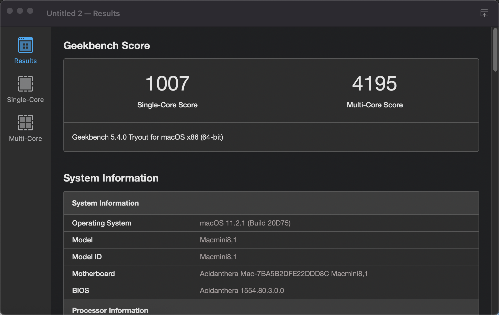
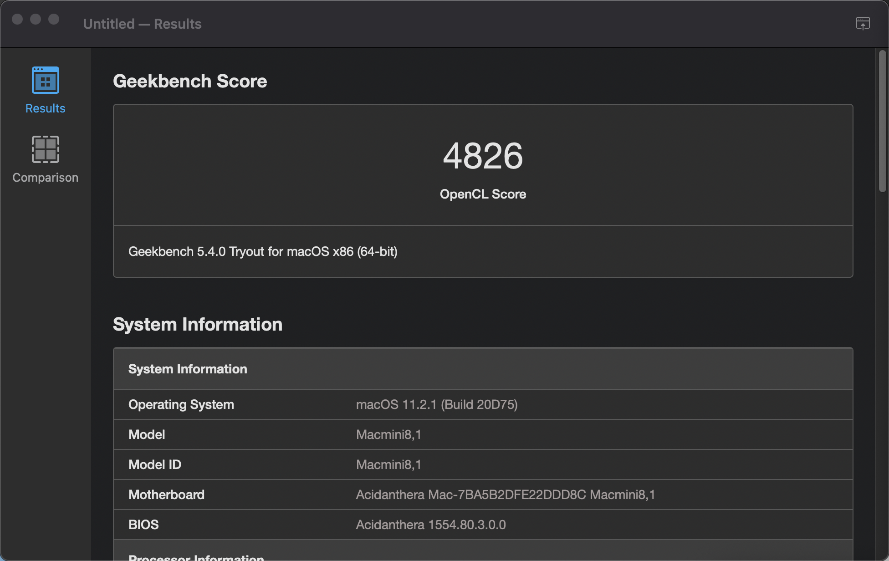

#### 这是一个DELL 5060MFF的黑苹果EFI
 - 所有功能都几乎玩美
 - 硬件：i5 8600t 16GB 铠侠C10 500GB  
 - Broadcom BCM43xx
##### BIOS设置
- 恢复出厂设置：Load Defaults（但更加推荐使用主板CMOS跳线进行完全复位）
- 关闭VT-d
- 关闭CFG Lock：0x5BE 0x0
- 设置64M预分配显存：0x8DC 0x2

***本EFI仅供参考，请自行修改三码使用***
 
 
